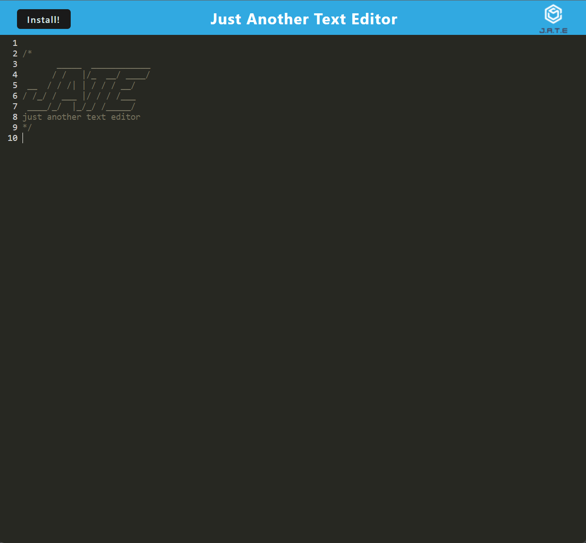

# Progressive Web Application: Text Editor

[](https://opensource.org/licenses/MIT)

## Description

This project aims to develop an API for a social network web application where users can share their thoughts, react to friends' thoughts, and create a friend list. The API is built using Express.js for routing, MongoDB for database storage, and Mongoose as the ODM. The primary goal is to understand the construction and structuring of APIs that handle large amounts of unstructured data typical of social networking platforms.

The motivation behind this project is to gain practical experience in building APIs for social networking platforms. By utilizing technologies commonly used in full-stack development, such as Express.js and MongoDB, this project aims to provide a hands-on learning experience in designing and implementing a scalable and efficient API.

### Problem Solving

The API allows users to perform various actions such as creating, updating, and deleting users and thoughts. Additionally, users can add and remove friends, as well as react to thoughts. The API's flexibility and functionality enable developers to handle complex interactions within a social network environment.

### Learning

Throughout the development process, I learned how to integrate IndexedDB for client-side storage, implement service workers for offline access, and optimize the application using webpack. Additionally, I gained insights into the principles of PWAs and their significance in modern web development.

## User Story

    AS A developer
    I WANT to create notes or code snippets with or without an internet connection
    SO THAT I can reliably retrieve them for later use


## Installation

To install and run this project locally, follow these steps:

1. Clone the repository to your local machine.
    
    git clone git@github.com:jodielee062788/socmed_api.git

2. Open the project folder in your code editor.

3. Ensure that MongoDB is installed on your machine.

4. Install the necessary dependencies by running the command:

    ```npm install```

5. Initiate the server using:

    ```npm run dev```

## Usage

The API offers endpoints for various operations. I'll demonstrate it using Insomnia:

1. Users: CRUD operations for managing users. Another functionality is the application deletes a user's associated thoughts when the user is deleted.
2. Thoughts: CRUD operations for managing thoughts.
3. Reactions: Adding and removing reactions to thoughts.
4. Friends: Adding and removing friends from a user's friend list.

    

## Walkthrough Video

Check out the walkthrough video of this Social Network API [here](https://drive.google.com/file/d/1OPwOVt2s4Byx8GR25s9PNP1MTHd8UUfb/view?usp=sharing/).

## Credits

Visit my github to see all my works and projects. Feel free to contact me if you have any questions through my email: jodielee062788@gmail.com

## License
This project is licensed under the MIT License - see the [LICENSE](./LICENSE) file for details.

## How to Contribute

If you'd like to contribute to this project, please follow these guidelines:

1. Fork this project.
2. Create a new branch for your feature or bug fix.
3. Commit your changes.
4. Submit a pull request.
