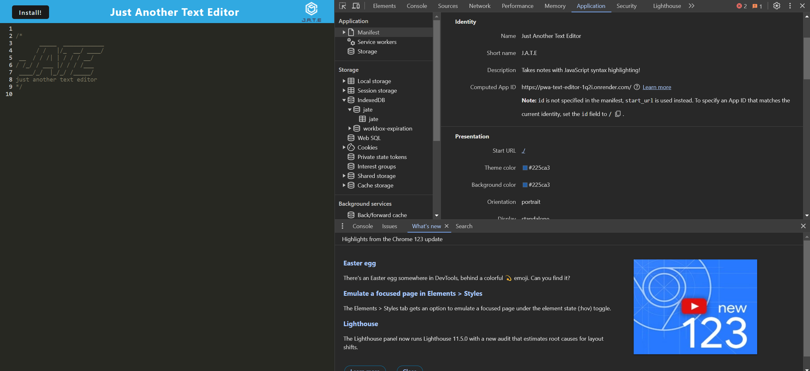
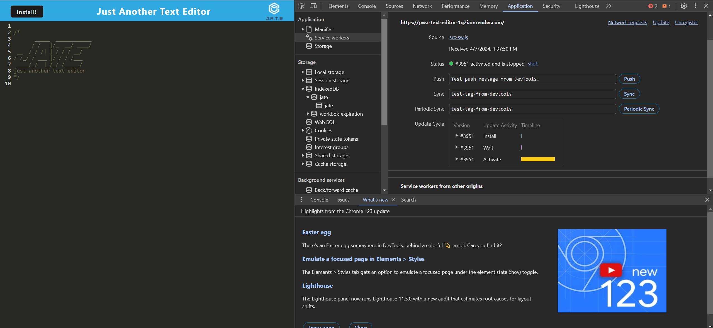
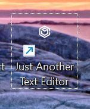

# Progressive Web Application: Text Editor

[](https://opensource.org/licenses/MIT)

## Description

This project aims to create a text editor as a Progressive Web Application (PWA) that runs seamlessly in the browser. 

The motivation behind this project is to provide users with a reliable tool for creating and storing notes or code snippets, with or without an internet connection. The project employs modern web technologies, including IndexedDB for data persistence, service workers for offline functionality, and webpack for bundling JavaScript files.

### Problem Solving 

By creating this project, I've made a text editor that works well anywhere, even when users are offline. This means users can write and access their notes or code snippets whenever they need, boosting productivity whether online or not.

### Learning

Throughout the development process, I learned how to integrate IndexedDB for client-side storage, implement service workers for offline access, and optimize the application using webpack. Additionally, I gained insights into the principles of PWAs and their significance in modern web development.

## User Story

    AS A developer
    I WANT to create notes or code snippets with or without an internet connection
    SO THAT I can reliably retrieve them for later use


## Installation

To install and run this project locally, follow these steps:

1. Clone the repository to your local machine.
    
    git clone git@github.com:jodielee062788/pwa_text_editor.git

2. Open the project folder in your code editor.

3. Install the necessary dependencies by running the command:

    ```npm install```

## Usage

Once the installation is complete, you can run the application using the following steps:

1. Start the backend server and serve the client:

    ```npm run start```

2. Open the application in your web browser. Upon opening the text editor, IndexedDB will immediately create a database storage for storing content. Enter your text or code snippets, and the content will be saved automatically. (Screenshots showing manifest file, registered service worker and IndexedDB storage.)

    

    

    

    

3. You can close the text editor and reopen it later to retrieve your saved content from IndexedDB.

4. To install the application as a PWA and download it as an icon on your desktop, click on the Install button provided.

    

     

## Deployed Application in Render

Check out the deployed application in Render [here](https://pwa-text-editor-1q2i.onrender.com/).

## Credits

Visit my github to see all my works and projects. Feel free to contact me if you have any questions through my email: jodielee062788@gmail.com

## License
This project is licensed under the MIT License - see the [LICENSE](./LICENSE) file for details.

## How to Contribute

If you'd like to contribute to this project, please follow these guidelines:

1. Fork this project.
2. Create a new branch for your feature or bug fix.
3. Commit your changes.
4. Submit a pull request.
